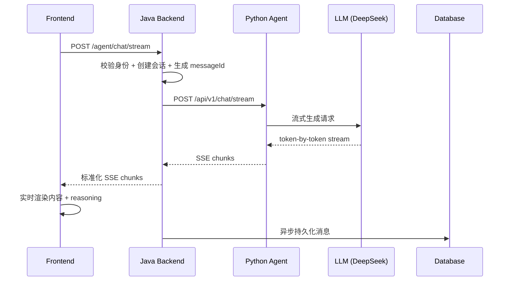

# 🤖 AI System - 智能求职助手

> 一个本地已跑通的三段式求职 Agent MVP，具备流式对话、权限管理、中断恢复等生产级能力。

[](#11-分层关系)
[](agent-frontend/)
[](java-backend/)
[](agent-python/)
[](agent-python/agent/infrastructure/llm/)

---

## 📋 目录

- [架构概览](#-架构概览)
- [核心特性](#-核心特性)
- [主流程](#-主流程)
- [接口文档](#-接口文档)
- [数据模型](#-数据模型)
- [本地运行](#-本地运行)
- [项目定位](#-项目定位)

---

## 🏗️ 架构概览

### 系统组成

本项目由三个独立服务组成，形成完整的三段式架构：

| 服务 | 技术栈 | 职责 |
|------|--------|------|
| **agent-frontend** | React 19 + TypeScript + Vite | 用户交互、流式渲染、会话管理 |
| **java-backend** | Spring Boot 3 + MyBatis-Plus + Redis | 业务逻辑、认证鉴权、SSE 网关 |
| **agent-python** | FastAPI + LangGraph + DeepSeek | Agent 编排、Prompt 工程、LLM 调用 |

### 1.1 分层关系

```text
┌─────────────┐
│   Browser   │
└──────┬──────┘
       │
       ▼
┌─────────────────────────────┐
│  agent-frontend (React)     │  ← 流式聊天、会话管理、本地缓存
└──────┬──────────────────────┘
       │
       ▼
┌─────────────────────────────┐
│  java-backend (Spring Boot) │  ← 认证、会话、SSE 转发、中断控制
└──┬───────────┬──────────────┘
   │           │
   ▼           ▼
┌──────┐    ┌──────┐
│MySQL │    │Redis │  ← 持久化存储 & 流式状态管理
└──────┘    └──────┘
   │
   ▼
┌─────────────────────────────┐
│  agent-python (FastAPI)     │  ← LangGraph 编排、DeepSeek 调用
└──────┬──────────────────────┘
       │
       ▼
┌─────────────┐
│ LLM Provider│
└─────────────┘
```

### 📦 服务职责详解

#### `agent-frontend` - 前端交互层

- 🎨 **技术栈**: React 19 + TypeScript + Vite
- 🖼️ **页面**: 落地页、登录注册页、聊天页、管理后台页
- 🌊 **流式渲染**: 基于 `fetch + ReadableStream` 消费 SSE 流
- 💾 **本地缓存**: 维护会话缓存，提升切换和刷新体验
- 🔌 **代理配置**: Vite Proxy 转发 `/agent`、`/auth`、`/conversation` 到 Java 后端

#### `java-backend` - 业务后端

- ⚙️ **技术栈**: Spring Boot 3 + Spring Security + MyBatis-Plus + Redis
- 🔐 **核心职责**:
  - 用户注册、登录、JWT 鉴权
  - 用户信息与管理后台能力
  - 会话列表、消息列表、删除会话
  - Python Agent 统一网关封装
  - 标准化 SSE 事件输出
  - 流式中断、超时、并发限制、恢复支持
- 💽 **数据存储**: MySQL (持久化) + Redis (流式临时状态与恢复)

#### `agent-python` - Agent 执行层

- 🧠 **技术栈**: FastAPI + LangGraph + LangChain
- 🎯 **核心功能**:
  - 接收聊天请求并组装 Prompt
  - 调用 DeepSeek 模型流式生成
  - 逐 chunk 返回 SSE 数据
  - 支持 abort 中断检查
- 📁 **分层结构**:
  - `api/` - HTTP 路由
  - `application/` - Agent 编排
  - `domain/` - 领域协议与实体
  - `infrastructure/` - Java 后端客户端、LLM 网关
  - `core/` - 配置、日志、中断、SSE 工具
  - `prompts/` - 系统提示词

## 🔄 核心主流程

### 2.1 登录与进入系统

1. 👤 用户访问前端首页
2. 🔐 未登录时进入 `LandingPage` / `AuthPage`
3. 📡 前端调用 Java 后端 `/auth/login` 或 `/auth/register`
4. ✅ 登录成功后，token 和用户信息写入本地存储
5. 🚀 进入 `/chat` 页面开始对话

### 2.2 流式对话链路



**详细流程**:

1. 🎯 前端在 `ChatPage` 中调用 `useSSEChat`
2. 📡 向 Java 后端发起 `POST /agent/chat/stream`
3. 🔍 Java 后端:
   - 校验用户身份
   - 获取或创建会话
   - 生成 `messageId`
   - 转发请求给 Python Agent
4. 🤖 Python Agent:
   - 组装 system prompt + user message
   - 调用 DeepSeek 流式生成
   - 逐 chunk 返回 SSE 数据
5. 🔄 Java 网关标准化输出:
   - `chunk` - 内容片段
   - `done` - 完成信号
   - `error` - 错误信号
   - `ping` - 心跳信号
6. 🎨 前端实时渲染内容与 reasoning
7. 💾 流完成后异步持久化用户消息与 AI 消息

### 2.3 中断与恢复能力

当前 MVP 已具备**生产级对话链路**，支持以下工程能力：

| 能力 | 说明 |
|------|------|
| ⏹️ **中断流式生成** | 支持 `abort` 即时停止生成 |
| 🎯 **精准定位流任务** | 按 `conversationId` / `messageId` 定位 |
| ⏱️ **超时与并发限制** | 防止资源耗尽和滥用 |
| 🔄 **Redis 流式恢复** | chunk 管理与断线恢复支持 |

> 💡 这意味着 MVP 已具备"生产化对话链路雏形"，而非 demo 级单轮问答。

## 🔌 接口文档

### 3.1 前端 → Java 后端

| 方法 | 路径 | 说明 |
|------|------|------|
| `POST` | `/auth/login` | 用户登录 |
| `POST` | `/auth/register` | 用户注册 |
| `GET` | `/conversation/list` | 获取会话列表 |
| `GET` | `/conversation/{id}/messages` | 获取消息列表 |
| `DELETE` | `/conversation/{id}` | 删除会话 |
| `POST` | `/agent/chat/stream` | 流式对话 |
| `POST` | `/agent/chat/stream/abort` | 中断流式生成 |
| `GET` | `/agent/chat/stream/recover` | 恢复流式生成 |
| `GET` | `/api/admin/users` | 获取用户列表 (Admin) |
| `POST` | `/api/admin/users` | 创建用户 (Admin) |
| `PUT` | `/api/admin/users/{id}` | 更新用户 (Admin) |
| `DELETE` | `/api/admin/users/{id}` | 删除用户 (Admin) |

### 3.2 Java 后端 → Python Agent

| 方法 | 路径 | 说明 |
|------|------|------|
| `POST` | `/api/v1/chat/stream` | 流式对话 |
| `POST` | `/api/v1/chat/stream/abort` | 中断流式生成 |
| `GET` | `/api/v1/health` | 健康检查 |

### 3.3 SSE 事件模型 (v2 Protocol)

Java 后端对 Python Agent 输出做了标准化，前端消费统一事件格式：

**Chunk 事件**:
```json
{
  "type": "chunk",
  "content": "本段回复内容",
  "index": 0,
  "reasoning": "可选的思考内容",
  "conversationId": 123,
  "messageId": "uuid",
  "requestId": "request-uuid",
  "userId": 1
}
```

**Done 事件**:
```json
{
  "type": "done",
  "info": "生成完成",
  "contentLength": 1024,
  "chunkCount": 50,
  "timestamp": 1712912400000
}
```

**Error 事件**:
```json
{
  "type": "error",
  "message": "错误信息",
  "errorCode": "ABORTED | STREAM_ERROR",
  "timestamp": 1712912400000
}
```

> 📌 **v2 协议变化**: 全链路追踪字段 (messageId, requestId, userId, conversationId)、新增 start 事件、完整性校验 (contentLength, chunkCount)

## 🗄️ 数据模型

当前数据库核心实体有三类：

| 实体 | 字段 | 说明 |
|------|------|------|
| **user** | 用户名、邮箱、密码、角色、状态 | 用户认证与权限管理 |
| **conversation** | 会话归属、标题、创建/更新时间 | 会话组织与管理 |
| **message** | 会话 ID、用户 ID、角色、内容、标题、流式状态、时间 | 消息持久化与审计 |

> 📌 **streamingStatus 字段**: `streaming` / `completed` / `error` / `aborted` - 用于追踪消息生命周期和审计

这套模型适合支撑当前 MVP 的"用户体系 + 会话历史 + 多轮对话"。

## 💡 架构优势与定位

### 5.1 核心优势

| 优势 | 说明 |
|------|------|
| 🔀 **解耦设计** | 前后端与 Agent 解耦，替换模型或框架成本低 |
| 🔐 **统一管理** | Java 后端收拢鉴权、会话、存储、SSE 管理，系统边界清晰 |
| 🧩 **独立演进** | Python Agent 单独演进 Prompt、工具调用、工作流，不影响主站 |
| 🎨 **流式体验** | 前端具备流式体验和本地缓存，用户感知完整 |

### 5.2 当前定位

这个 MVP 现在是：

✅ "求职对话系统"  
✅ "后续可接工具和工作流的 Agent 平台雏形"

它还不是：

❌ 全自动投递系统  
❌ 复杂多工具自治 Agent 平台  
❌ 具备文档解析、浏览器自动操作、PPT 生成闭环的平台

## 🚀 本地运行

### 启动顺序

| 步骤 | 服务 | 端口 | 命令 |
|------|------|------|------|
| 1 | `agent-python` | 5001 | `cd agent-python && python -m uvicorn agent.main:app --reload --port 5001` |
| 2 | `java-backend` | 8080 | `cd java-backend && ./mvnw spring-boot:run` |
| 3 | `agent-frontend` | 5173 | `cd agent-frontend && pnpm dev` |

### 服务间通信

```
Frontend (5173) ──proxy──> Java Backend (8080) ──gateway──> Python Agent (5001)
```

- 🌐 前端代理目标: `http://localhost:8080`
- 🔗 Java 后端配置的 Python Agent 地址: `http://localhost:5001`

## 🎯 展示能力与一句话定义

### 核心展示能力

如果你要对外介绍这个项目，最值得强调的是这几个点：

| 能力 | 说明 |
|------|------|
| 🏗️ **三段式架构** | 前端、业务后端、Agent 执行层解耦 |
| 🔐 **权限管理** | 支持登录注册、权限控制、用户管理 |
| 💬 **多轮会话** | 支持历史消息查询与删除 |
| 🌊 **流式输出** | SSE 流式输出与前端实时渲染 |
| ⏹️ **中断恢复** | 支持中断生成、并发限制、恢复机制 |
| 🧩 **可扩展设计** | Agent 端已按可扩展分层设计，适合后续接入工具调用 |

---

## 📌 一句话定义

> **这是一个"本地已跑通的求职 Agent MVP"**，已经完成了从用户进入系统、发起对话、流式生成、消息持久化到会话管理的闭环，并为后续扩展职位抓取、简历优化、岗位匹配和工具调度预留了清晰边界。

---

<div align="center">
  <p>Made with ❤️ by Caius</p>
  <p><sub>© 2026 AI System. All rights reserved.</sub></p>
</div>
